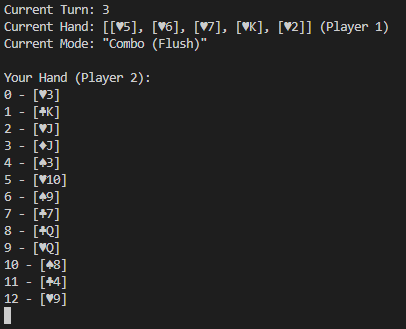

# Big Two
[Big Two](https://en.wikipedia.org/wiki/Big_two) in Rust



## Rules
Read the basic rule [here](https://www.pagat.com/climbing/bigtwo.html).

## Usage
```bash
Command-line Big 2 card game

Usage: big2.exe [OPTIONS]

Options:
  -p, --players <PLAYERS>  Number of players [default: 4]
      --hotseat            Play a hotseat game without AI
  -h, --help               Print help information
  -V, --version            Print version information
```

Play a hotseat game where you control each move.
```
cargo run -- -p 4 --hotseat
```

Play a game with computer players.
```
cargo run -- -p 4
```


## TODO
- [ ] Remake in `bevy`.
